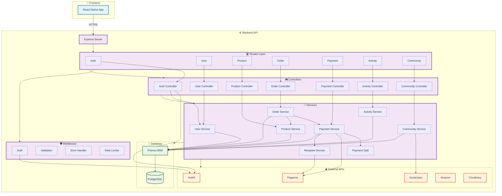
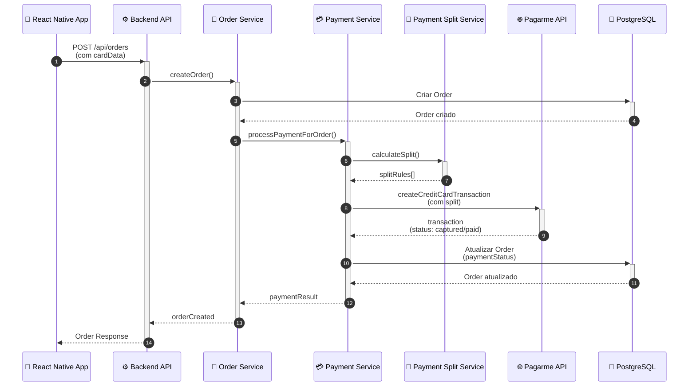
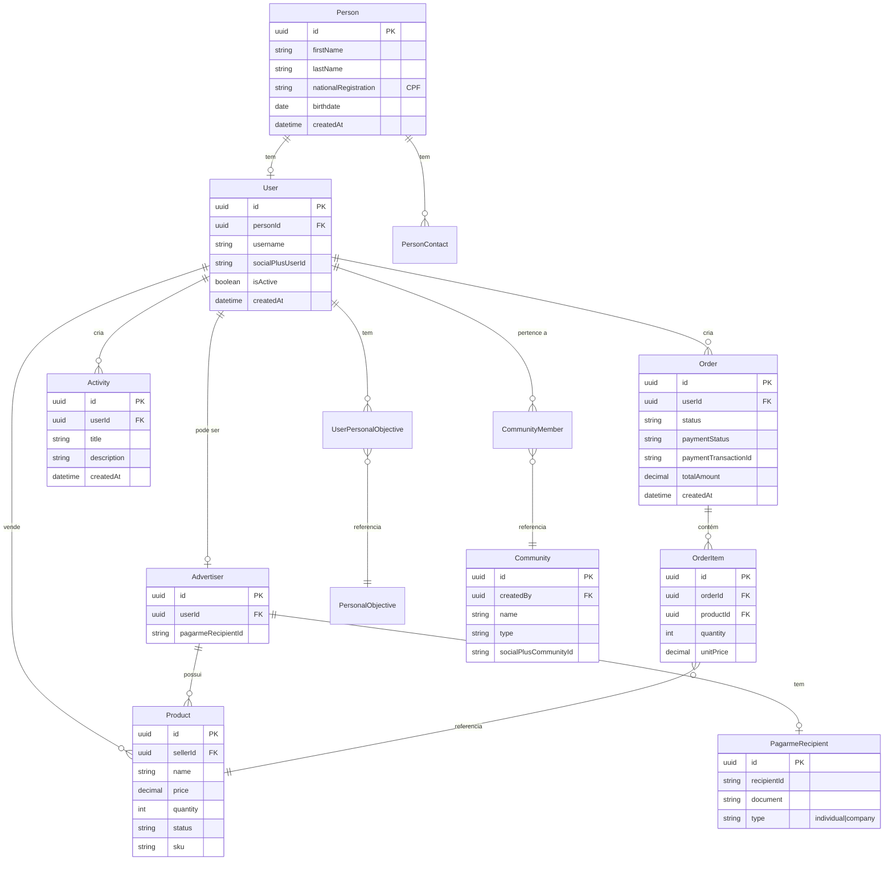
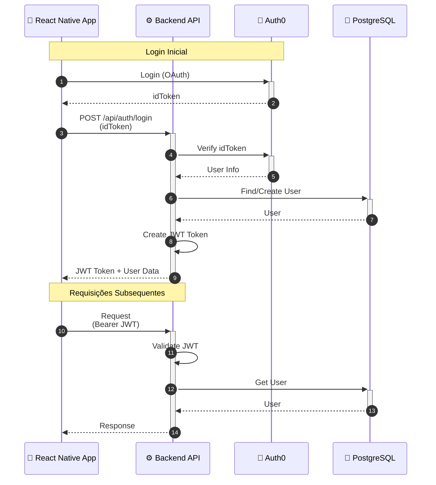
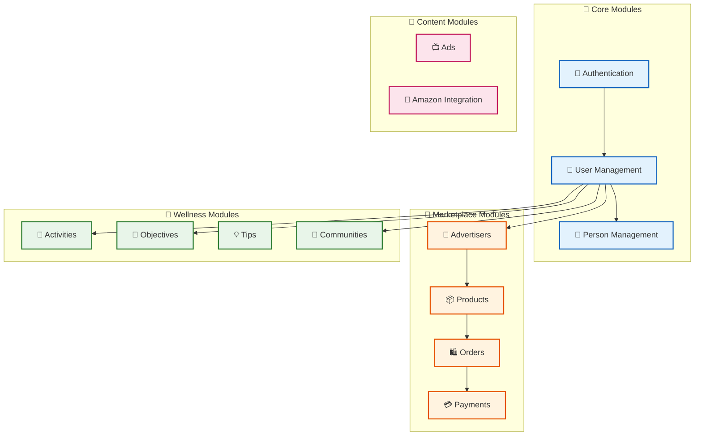

# Arquitetura do Sistema LikeMe

## Diagrama de Arquitetura Geral

```mermaid
graph TB
    subgraph Frontend["📱 Frontend"]
        APP["React Native App"]
    end

    subgraph Backend["⚙️ Backend API"]
        SERVER["Express Server"]
        
        subgraph Routes["🛣️ Routes Layer"]
            AUTH_R["Auth"]
            USER_R["User"]
            PRODUCT_R["Product"]
            ORDER_R["Order"]
            PAYMENT_R["Payment"]
            ACTIVITY_R["Activity"]
            COMMUNITY_R["Community"]
        end
        
        subgraph Controllers["🎮 Controllers"]
            AUTH_C["Auth Controller"]
            USER_C["User Controller"]
            PRODUCT_C["Product Controller"]
            ORDER_C["Order Controller"]
            PAYMENT_C["Payment Controller"]
            ACTIVITY_C["Activity Controller"]
            COMMUNITY_C["Community Controller"]
        end
        
        subgraph Services["🔧 Services"]
            USER_S["User Service"]
            PRODUCT_S["Product Service"]
            ORDER_S["Order Service"]
            PAYMENT_S["Payment Service"]
            PAYMENT_SPLIT["Payment Split"]
            RECIPIENT_S["Recipient Service"]
            ACTIVITY_S["Activity Service"]
            COMMUNITY_S["Community Service"]
        end
        
        subgraph External["🌐 External APIs"]
            PAGARME["Pagarme"]
            AUTH0["Auth0"]
            SOCIAL_PLUS["Social.plus"]
            AMAZON["Amazon"]
            CLOUDINARY["Cloudinary"]
        end
        
        subgraph Database["💾 Database"]
            PRISMA["Prisma ORM"]
            POSTGRES[("PostgreSQL")]
        end
        
        subgraph Middleware["🛡️ Middleware"]
            AUTH_MW["Auth"]
            VALIDATION_MW["Validation"]
            ERROR_MW["Error Handler"]
            RATE_LIMIT["Rate Limiter"]
        end
    end

    APP -->|HTTPS| SERVER
    
    SERVER --> Routes
    Routes --> Middleware
    Routes --> Controllers
    Controllers --> Services
    Services --> Database
    Services --> External
    
    AUTH_R --> AUTH_C
    USER_R --> USER_C
    PRODUCT_R --> PRODUCT_C
    ORDER_R --> ORDER_C
    PAYMENT_R --> PAYMENT_C
    ACTIVITY_R --> ACTIVITY_C
    COMMUNITY_R --> COMMUNITY_C
    
    AUTH_C --> AUTH0
    AUTH_C --> USER_S
    USER_C --> USER_S
    PRODUCT_C --> PRODUCT_S
    ORDER_C --> ORDER_S
    PAYMENT_C --> PAYMENT_S
    ACTIVITY_C --> ACTIVITY_S
    COMMUNITY_C --> COMMUNITY_S
    
    ORDER_S --> PAYMENT_S
    ORDER_S --> PRODUCT_S
    PAYMENT_S --> PAYMENT_SPLIT
    PAYMENT_S --> PAGARME
    PAYMENT_S --> RECIPIENT_S
    RECIPIENT_S --> PAGARME
    COMMUNITY_S --> SOCIAL_PLUS
    
    USER_S --> PRISMA
    PRODUCT_S --> PRISMA
    ORDER_S --> PRISMA
    PAYMENT_S --> PRISMA
    ACTIVITY_S --> PRISMA
    COMMUNITY_S --> PRISMA
    
    PRISMA --> POSTGRES
    
    AUTH_MW --> AUTH0
    
    classDef frontend fill:#e1f5ff,stroke:#01579b,stroke-width:2px
    classDef backend fill:#f3e5f5,stroke:#4a148c,stroke-width:2px
    classDef external fill:#fff3e0,stroke:#e65100,stroke-width:2px
    classDef database fill:#e8f5e9,stroke:#1b5e20,stroke-width:2px
    
    class APP frontend
    class SERVER,Routes,Controllers,Services,Middleware backend
    class PAGARME,AUTH0,SOCIAL_PLUS,AMAZON,CLOUDINARY external
    class PRISMA,POSTGRES database
```

## Fluxo de Pagamento

```mermaid
sequenceDiagram
    autonumber
    participant App as 📱 React Native App
    participant API as ⚙️ Backend API
    participant OrderSvc as 🛒 Order Service
    participant PaymentSvc as 💳 Payment Service
    participant SplitSvc as 🔀 Payment Split Service
    participant Pagarme as 🌐 Pagarme API
    participant DB as 💾 PostgreSQL

    App->>+API: POST /api/orders<br/>(com cardData)
    API->>+OrderSvc: createOrder()
    OrderSvc->>+DB: Criar Order
    DB-->>-OrderSvc: Order criado
    OrderSvc->>+PaymentSvc: processPaymentForOrder()
    PaymentSvc->>+SplitSvc: calculateSplit()
    SplitSvc-->>-PaymentSvc: splitRules[]
    PaymentSvc->>+Pagarme: createCreditCardTransaction<br/>(com split)
    Pagarme-->>-PaymentSvc: transaction<br/>(status: captured/paid)
    PaymentSvc->>+DB: Atualizar Order<br/>(paymentStatus)
    DB-->>-PaymentSvc: Order atualizado
    PaymentSvc-->>-OrderSvc: paymentResult
    OrderSvc-->>-API: orderCreated
    API-->>-App: Order Response
```

## Modelo de Dados Principal

```mermaid
erDiagram
    Person ||--o| User : "tem"
    Person ||--o{ PersonContact : "tem"
    User ||--o{ Order : "cria"
    User ||--o| Advertiser : "pode ser"
    User ||--o{ Activity : "cria"
    User ||--o{ Product : "vende"
    Advertiser ||--o{ Product : "possui"
    Order ||--o{ OrderItem : "contém"
    OrderItem }o--|| Product : "referencia"
    Advertiser ||--o| PagarmeRecipient : "tem"
    User ||--o{ UserPersonalObjective : "tem"
    UserPersonalObjective }o--|| PersonalObjective : "referencia"
    User ||--o{ CommunityMember : "pertence a"
    CommunityMember }o--|| Community : "referencia"

    Person {
        uuid id PK
        string firstName
        string lastName
        string nationalRegistration "CPF"
        date birthdate
        datetime createdAt
    }
    
    User {
        uuid id PK
        uuid personId FK
        string username
        string socialPlusUserId
        boolean isActive
        datetime createdAt
    }
    
    Product {
        uuid id PK
        uuid sellerId FK
        string name
        decimal price
        int quantity
        string status
        string sku
    }
    
    Order {
        uuid id PK
        uuid userId FK
        string status
        string paymentStatus
        string paymentTransactionId
        decimal totalAmount
        datetime createdAt
    }
    
    OrderItem {
        uuid id PK
        uuid orderId FK
        uuid productId FK
        int quantity
        decimal unitPrice
    }
    
    Advertiser {
        uuid id PK
        uuid userId FK
        string pagarmeRecipientId
    }
    
    PagarmeRecipient {
        uuid id PK
        string recipientId
        string document
        string type "individual|company"
    }
    
    Activity {
        uuid id PK
        uuid userId FK
        string title
        string description
        datetime createdAt
    }
    
    Community {
        uuid id PK
        uuid createdBy FK
        string name
        string type
        string socialPlusCommunityId
    }
```

## Fluxo de Autenticação

```mermaid
sequenceDiagram
    autonumber
    participant App as 📱 React Native App
    participant API as ⚙️ Backend API
    participant Auth0 as 🔐 Auth0
    participant DB as 💾 PostgreSQL

    Note over App,Auth0: Login Inicial
    App->>+Auth0: Login (OAuth)
    Auth0-->>-App: idToken
    
    App->>+API: POST /api/auth/login<br/>(idToken)
    API->>+Auth0: Verify idToken
    Auth0-->>-API: User Info
    API->>+DB: Find/Create User
    DB-->>-API: User
    API->>API: Create JWT Token
    API-->>-App: JWT Token + User Data
    
    Note over App,API: Requisições Subsequentes
    App->>+API: Request<br/>(Bearer JWT)
    API->>API: Validate JWT
    API->>+DB: Get User
    DB-->>-API: User
    API-->>-App: Response
```

## Estrutura de Módulos

```mermaid
graph TD
    subgraph Core["🔐 Core Modules"]
        AUTH["🔑 Authentication"]
        USER["👤 User Management"]
        PERSON["👥 Person Management"]
    end
    
    subgraph Marketplace["🛒 Marketplace Modules"]
        PRODUCT["📦 Products"]
        ORDER["🛍️ Orders"]
        PAYMENT["💳 Payments"]
        ADVERTISER["📢 Advertisers"]
    end
    
    subgraph Wellness["💚 Wellness Modules"]
        ACTIVITY["🏃 Activities"]
        OBJECTIVE["🎯 Objectives"]
        TIP["💡 Tips"]
        COMMUNITY["👥 Communities"]
    end
    
    subgraph Content["📰 Content Modules"]
        AD["📺 Ads"]
        AMAZON["🛒 Amazon Integration"]
    end
    
    AUTH --> USER
    USER --> PERSON
    USER --> ADVERTISER
    ADVERTISER --> PRODUCT
    PRODUCT --> ORDER
    ORDER --> PAYMENT
    USER --> ACTIVITY
    USER --> OBJECTIVE
    USER --> COMMUNITY
    
    classDef core fill:#e3f2fd,stroke:#1565c0,stroke-width:2px
    classDef marketplace fill:#fff3e0,stroke:#e65100,stroke-width:2px
    classDef wellness fill:#e8f5e9,stroke:#2e7d32,stroke-width:2px
    classDef content fill:#fce4ec,stroke:#c2185b,stroke-width:2px
    
    class AUTH,USER,PERSON core
    class PRODUCT,ORDER,PAYMENT,ADVERTISER marketplace
    class ACTIVITY,OBJECTIVE,TIP,COMMUNITY wellness
    class AD,AMAZON content
```

