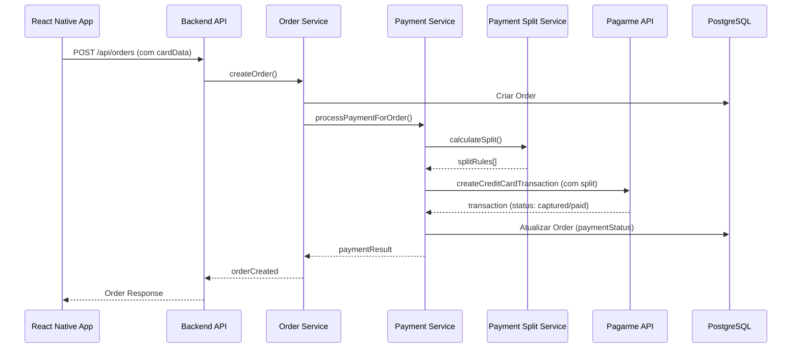
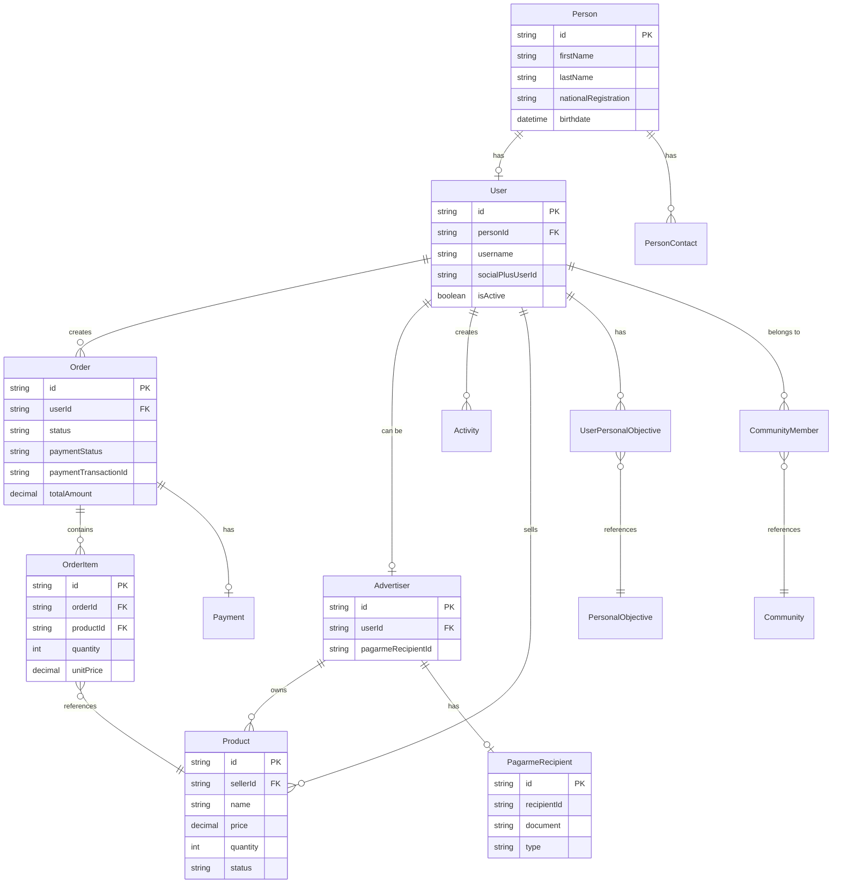
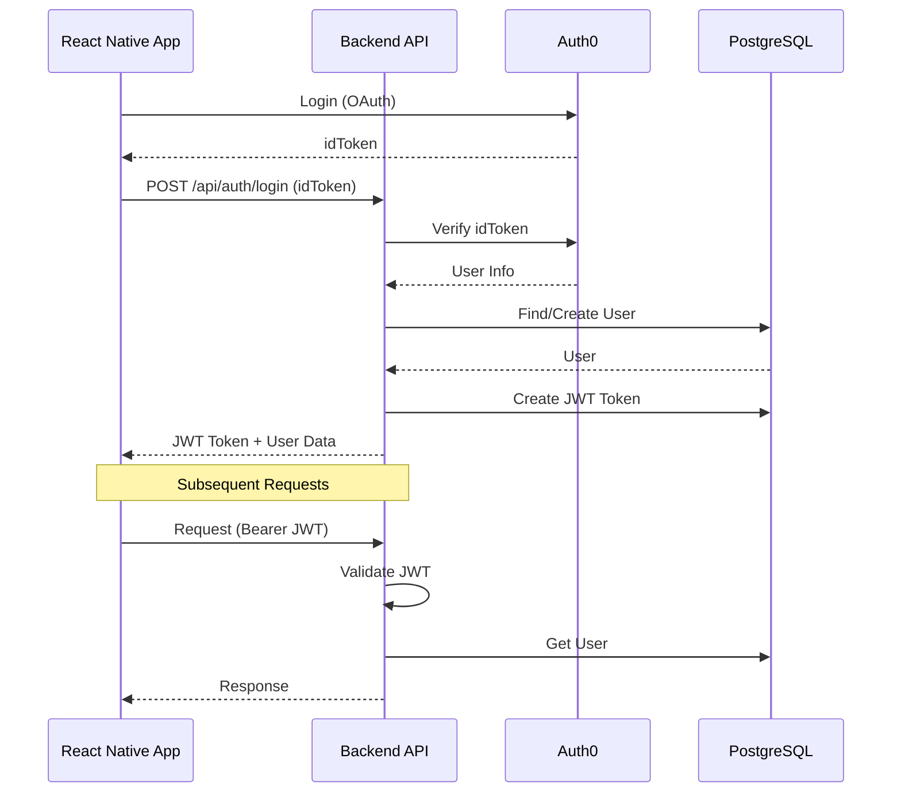
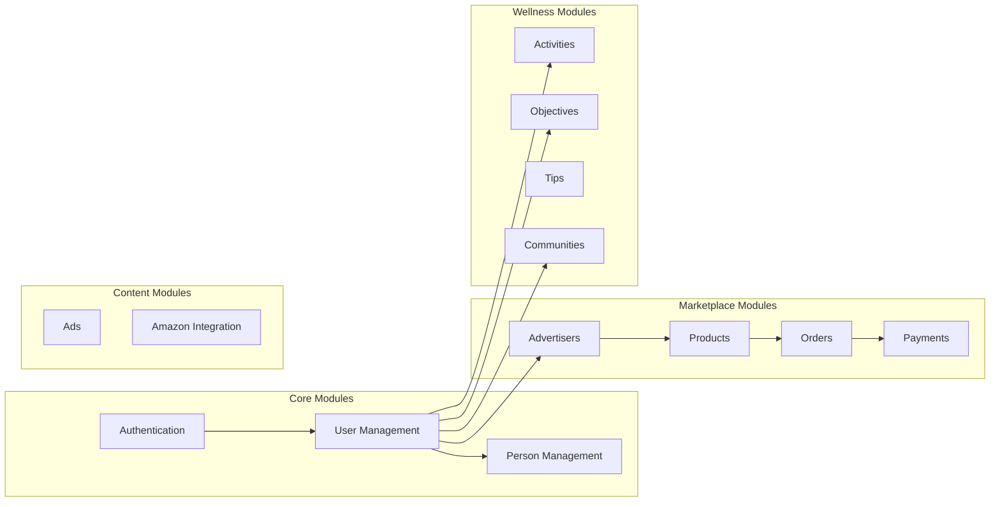

# Arquitetura do Sistema LikeMe

## Diagrama de Arquitetura Geral

```mermaid
graph TB
    subgraph "Frontend"
        APP[React Native App]
    end

    subgraph "Backend API"
        SERVER[Express Server]
        
        subgraph "Routes Layer"
            AUTH_ROUTES[Auth Routes]
            USER_ROUTES[User Routes]
            PRODUCT_ROUTES[Product Routes]
            ORDER_ROUTES[Order Routes]
            PAYMENT_ROUTES[Payment Routes]
            ACTIVITY_ROUTES[Activity Routes]
            COMMUNITY_ROUTES[Community Routes]
        end
        
        subgraph "Controllers Layer"
            AUTH_CTRL[Auth Controller]
            USER_CTRL[User Controller]
            PRODUCT_CTRL[Product Controller]
            ORDER_CTRL[Order Controller]
            PAYMENT_CTRL[Payment Controller]
            ACTIVITY_CTRL[Activity Controller]
            COMMUNITY_CTRL[Community Controller]
        end
        
        subgraph "Services Layer"
            USER_SVC[User Service]
            PRODUCT_SVC[Product Service]
            ORDER_SVC[Order Service]
            PAYMENT_SVC[Payment Service]
            PAYMENT_SPLIT[Payment Split Service]
            RECIPIENT_SVC[Recipient Service]
            ACTIVITY_SVC[Activity Service]
            COMMUNITY_SVC[Community Service]
        end
        
        subgraph "External Clients"
            PAGARME[Pagarme Client]
            AUTH0[Auth0]
            SOCIAL_PLUS[Social.plus SDK]
            AMAZON[Amazon Client]
            CLOUDINARY[Cloudinary]
        end
        
        subgraph "Database"
            PRISMA[Prisma ORM]
            POSTGRES[(PostgreSQL)]
        end
        
        subgraph "Middleware"
            AUTH_MW[Auth Middleware]
            VALIDATION_MW[Validation Middleware]
            ERROR_MW[Error Handler]
            RATE_LIMIT[Rate Limiter]
        end
    end

    APP -->|HTTPS| SERVER
    SERVER --> AUTH_ROUTES
    SERVER --> USER_ROUTES
    SERVER --> PRODUCT_ROUTES
    SERVER --> ORDER_ROUTES
    SERVER --> PAYMENT_ROUTES
    SERVER --> ACTIVITY_ROUTES
    SERVER --> COMMUNITY_ROUTES
    
    AUTH_ROUTES --> AUTH_MW
    AUTH_ROUTES --> AUTH_CTRL
    USER_ROUTES --> AUTH_MW
    USER_ROUTES --> USER_CTRL
    PRODUCT_ROUTES --> AUTH_MW
    PRODUCT_ROUTES --> PRODUCT_CTRL
    ORDER_ROUTES --> AUTH_MW
    ORDER_ROUTES --> ORDER_CTRL
    PAYMENT_ROUTES --> AUTH_MW
    PAYMENT_ROUTES --> PAYMENT_CTRL
    ACTIVITY_ROUTES --> AUTH_MW
    ACTIVITY_ROUTES --> ACTIVITY_CTRL
    COMMUNITY_ROUTES --> AUTH_MW
    COMMUNITY_ROUTES --> COMMUNITY_CTRL
    
    AUTH_CTRL --> AUTH0
    AUTH_CTRL --> USER_SVC
    USER_CTRL --> USER_SVC
    PRODUCT_CTRL --> PRODUCT_SVC
    ORDER_CTRL --> ORDER_SVC
    PAYMENT_CTRL --> PAYMENT_SVC
    ACTIVITY_CTRL --> ACTIVITY_SVC
    COMMUNITY_CTRL --> COMMUNITY_SVC
    
    ORDER_SVC --> PAYMENT_SVC
    ORDER_SVC --> PRODUCT_SVC
    PAYMENT_SVC --> PAYMENT_SPLIT
    PAYMENT_SVC --> PAGARME
    PAYMENT_SVC --> RECIPIENT_SVC
    RECIPIENT_SVC --> PAGARME
    COMMUNITY_SVC --> SOCIAL_PLUS
    
    USER_SVC --> PRISMA
    PRODUCT_SVC --> PRISMA
    ORDER_SVC --> PRISMA
    PAYMENT_SVC --> PRISMA
    ACTIVITY_SVC --> PRISMA
    COMMUNITY_SVC --> PRISMA
    
    PRISMA --> POSTGRES
    
    AUTH_MW --> AUTH0
    VALIDATION_MW --> SERVER
    ERROR_MW --> SERVER
    RATE_LIMIT --> SERVER
```

## Fluxo de Pagamento

```mermaid
sequenceDiagram
    participant App as React Native App
    participant API as Backend API
    participant OrderSvc as Order Service
    participant PaymentSvc as Payment Service
    participant SplitSvc as Payment Split Service
    participant Pagarme as Pagarme API
    participant DB as PostgreSQL

    App->>API: POST /api/orders (com cardData)
    API->>OrderSvc: createOrder()
    OrderSvc->>DB: Criar Order
    OrderSvc->>PaymentSvc: processPaymentForOrder()
    PaymentSvc->>SplitSvc: calculateSplit()
    SplitSvc-->>PaymentSvc: splitRules[]
    PaymentSvc->>Pagarme: createCreditCardTransaction (com split)
    Pagarme-->>PaymentSvc: transaction (status: captured/paid)
    PaymentSvc->>DB: Atualizar Order (paymentStatus)
    PaymentSvc-->>OrderSvc: paymentResult
    OrderSvc-->>API: orderCreated
    API-->>App: Order Response
```

## Modelo de Dados Principal

```mermaid
erDiagram
    Person ||--o| User : "has"
    Person ||--o{ PersonContact : "has"
    User ||--o{ Order : "creates"
    User ||--o| Advertiser : "can be"
    User ||--o{ Activity : "creates"
    User ||--o{ Product : "sells"
    Advertiser ||--o{ Product : "owns"
    Order ||--o{ OrderItem : "contains"
    OrderItem }o--|| Product : "references"
    Order ||--o| Payment : "has"
    Advertiser ||--o| PagarmeRecipient : "has"
    User ||--o{ UserPersonalObjective : "has"
    UserPersonalObjective }o--|| PersonalObjective : "references"
    User ||--o{ CommunityMember : "belongs to"
    CommunityMember }o--|| Community : "references"

    Person {
        string id PK
        string firstName
        string lastName
        string nationalRegistration
        datetime birthdate
    }
    
    User {
        string id PK
        string personId FK
        string username
        string socialPlusUserId
        boolean isActive
    }
    
    Product {
        string id PK
        string sellerId FK
        string name
        decimal price
        int quantity
        string status
    }
    
    Order {
        string id PK
        string userId FK
        string status
        string paymentStatus
        string paymentTransactionId
        decimal totalAmount
    }
    
    OrderItem {
        string id PK
        string orderId FK
        string productId FK
        int quantity
        decimal unitPrice
    }
    
    Advertiser {
        string id PK
        string userId FK
        string pagarmeRecipientId
    }
    
    PagarmeRecipient {
        string id PK
        string recipientId
        string document
        string type
    }
```

## Fluxo de Autenticação

```mermaid
sequenceDiagram
    participant App as React Native App
    participant API as Backend API
    participant Auth0 as Auth0
    participant DB as PostgreSQL

    App->>Auth0: Login (OAuth)
    Auth0-->>App: idToken
    App->>API: POST /api/auth/login (idToken)
    API->>Auth0: Verify idToken
    Auth0-->>API: User Info
    API->>DB: Find/Create User
    DB-->>API: User
    API->>DB: Create JWT Token
    API-->>App: JWT Token + User Data
    
    Note over App,API: Subsequent Requests
    App->>API: Request (Bearer JWT)
    API->>API: Validate JWT
    API->>DB: Get User
    API-->>App: Response
```

## Estrutura de Módulos

```mermaid
graph LR
    subgraph "Core Modules"
        AUTH[Authentication]
        USER[User Management]
        PERSON[Person Management]
    end
    
    subgraph "Marketplace Modules"
        PRODUCT[Products]
        ORDER[Orders]
        PAYMENT[Payments]
        ADVERTISER[Advertisers]
    end
    
    subgraph "Wellness Modules"
        ACTIVITY[Activities]
        OBJECTIVE[Objectives]
        TIP[Tips]
        COMMUNITY[Communities]
    end
    
    subgraph "Content Modules"
        AD[Ads]
        AMAZON[Amazon Integration]
    end
    
    AUTH --> USER
    USER --> PERSON
    USER --> ADVERTISER
    ADVERTISER --> PRODUCT
    PRODUCT --> ORDER
    ORDER --> PAYMENT
    USER --> ACTIVITY
    USER --> OBJECTIVE
    USER --> COMMUNITY
```

